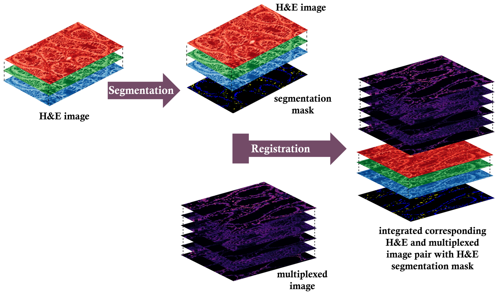
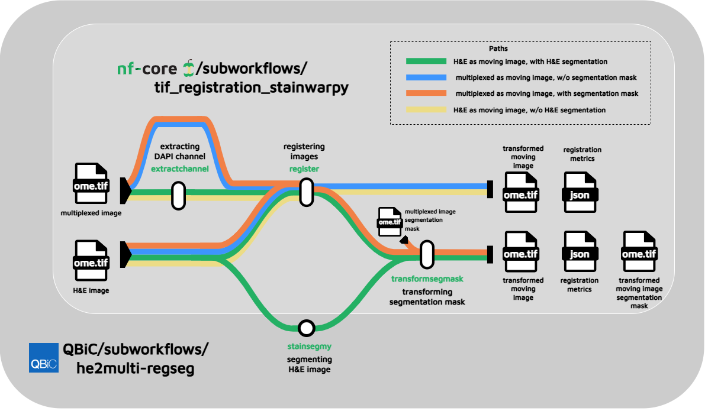

# Integration of HnE Staining and Highly Multiplexed Tissue Imaging

This project focuses on integration of HnE staining and highly multiplexed tissue imaging incorporating HnE segmentation with HnE and multiplexed image registration. 

---

## Abstract

Histopathology imaging plays a crucial role in diagnostic medicine and research, with HnE (hematoxylin and eosin) being the most widely used staining technique providing important information on tissue architecture and context. While it lacks rich information for cell type identification, highly multiplexed imaging, which stains multiple biomarkers on a single tissue section provides detailed phenotypic and functional information. Integration of these two complimentary modalities is limited by their lack of spatial correspondence. This thesis proposes a workflow for integration of these two modalities incorporating H\&E image segmentation and multi-modal image registration. 

Several conventional methods, feature-based and intensity-based techniques were evaluated for HnE and multiplexed image registration. Feature-based rigid registration was concluded as the best and appropriate registration method for our use case. Two U-Net variants, basic U-Net and the proposed U-NeXt architecture, which is an updated U-Net inspired by principles of transformers, were trained for HnE segmentation. Both models exhibited better performance than the baseline, with U-Net giving the best performance. Best registration and segmentation methods were incorporated into a containerized, modular subworkflow for interoperable HnE and highly-multiplexed image integration.

Overall, this thesis focuses on providing a scalable framework for H\&E and highly multiplexed image integration, through deep-learning based H\&E segmentation with feature-based H\&E and multiplexed image registration. 

---

## Overview of the Project

  

**Figure 1:** Overview of the process, including image registration, segmentation and integration.

---

## End-to-end subworkflow for integration

  

**Figure 2:** Subworkflow **he2multi-regseg** for integrating **stainsegmy** deep-learning segmentation module, and **stainwarpy** image registration modules.

---

## Contributions and Code Availability

A collection of tools, modules and workflows for image registration, segmentation and multi-modal histopathology integration.

### Core Tools

  

- **stainwarpy** — Image registration tool  
    

  

- **stainsegmy** — Image segmentation tool  
    

### nf-core Modules & Workflows

- **stainwarpy module (nf-core)**  
  

- **tif_registration_stainwarpy subworkflow (nf-core)**  
  

### QBiC Pipelines

- **stainsegmy segmentation module**  
  https://github.com/qbic-pipelines/nextflow-modules/tree/main/modules/qbic/stainsegmy

- **he2multi-regseg (multi-modal integration subworkflow)**  
  https://github.com/qbic-pipelines/nextflow-modules/tree/main/subworkflows/qbic/he2multi-regseg

### Research & Implementations

- Image registration techniques implementation  
  https://github.com/tckumarasekara/he2multi-reg  

- Deep-learning training module for segmentation  
  https://github.com/qbic-pipelines/CRC-HnE-Segmentation-Training  

### Models & Data

- Published trained models (Zenodo)  
  

---

## Supervision

This work was developed as a masters' thesis project under the supervision of Dr. Luis Kuhn Cueller, Carolin Schwitalla and Prof. Dr. Sven Nahnsen from QBiC, M3 Research Centre, University Hospital Tübingen.

